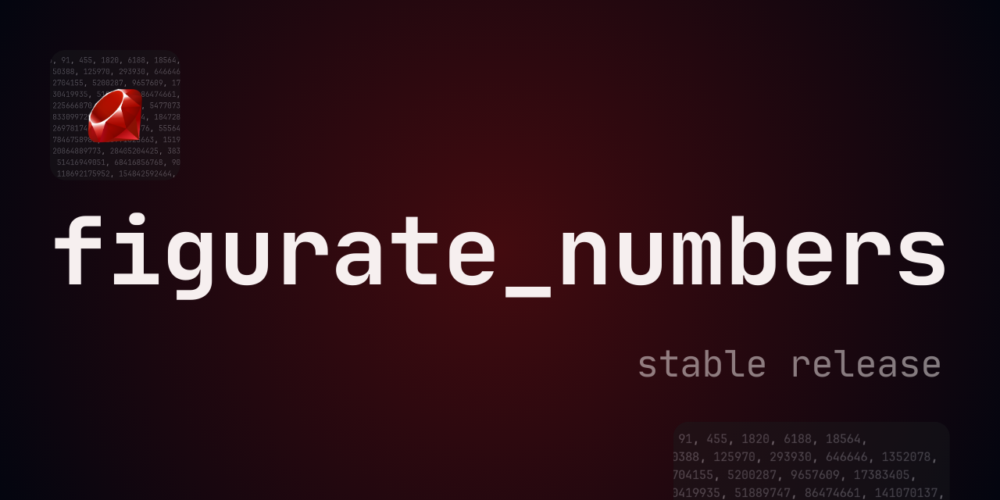

<h1 align="center"> Figurate Numbers </h1>

**Figurate Numbers** is the most comprehensive and specialized library for figurate numbers, developed in Ruby to date.
It implements **241 infinite number sequences** inspired by the groundbreaking work [*Figurate Numbers*](https://books.google.com.pe/books/about/Figurate_Numbers.html?id=ERS7CgAAQBAJ&redir_esc=y) by Elena Deza and Michel Deza, published in 2012.

<p align="center">
  
  
  
    
</p>



## Installation

Install it from the gem repository:

```rb
gem install figurate_numbers
```

## Features

This implementation uses the **Enumerator class** to handle **infinite sequences**.
It is intended for use in mathematical projects and with Sonic Pi.

Following the order of the book, the methods are divided into 3 types according to the spatial dimension (see complete list below):

1. **PlaneFigurateNumbers** figurate numbers implemented = `79`
2. **SpaceFigurateNumbers** figurate numbers implemented = `86`
3. **MultiDimensionalFigurateNumbers** figurate numbers implemented = `70`
4. **Zoo of figurate-related numbers** implemented = `6` (included in MultiDimensional module)

- [x] **TOTAL** = `241` infinite sequences of figurate numbers implemented

##  How to use in Ruby

```rb
require 'figurate_numbers'

## Using take(integer)
FigurateNumbers.pentatope.take(10)

## Storing and iterating
f = FigurateNumbers.centered_octagonal_pyramid
f.next
f.next
f.next
```

If the sequence is defined with `lazy`, to make the numbers explicit we must include the converter method `to_a` at the end.

Since version **1.4.0**, you can alternatively call from the classes
```rb
PlaneFigurateNumbers.polygonal(3)
SpaceFigurateNumbers.rhombic_dodecahedral
MultiDimensionalFigurateNumbers.six_dimensional_hyperoctahedron
```

This ensures that you only use the numbers belonging to each geometric dimension.

## How to use in Sonic Pi

### figurate_numbers - Version 1.4.0

Starting from version **1.4.0**, you can use the library globally through `FigurateNumbers`to access all sequences, or you can use the specific classes mentioned above for separate access.
The main change compared to version **1.3.0** is that you now need to import the file using **require** instead of **run_file**; otherwise, it will not function.

```rb
require "<PATH>"
```

Simply copy the entry point path from the `lib/figurate_numbers.rb` file where the *gem* is installed.

### figurate_numbers - Version 1.3.0

You can read and comment in the [**Sonic Pi community thread right here!**](https://in-thread.sonic-pi.net/t/figurate-numbers-for-sonic-pi-new-ruby-gem-for-infinite-number-sequences-and-patterns/8962)

1. Locate or download the file in the path `lib/figurate_numbers.rb`
2. Drag the file to a buffer in Sonic Pi (this generates the `<PATH>`)

```rb
run_file "<PATH>"
sleep 1 # see the quote below
pol_num = FigurateNumbers.polygonal_numbers(8)
80.times do
  play pol_num.next % 12 * 7  # Some mathematical function or transformation
  sleep 0.25
end
```

> `sleep 1` #to allow **figurate_numbers** to complete load and setup otherwise first run can give error ([Robin Newman](https://in-thread.sonic-pi.net/t/figurate-numbers-for-sonic-pi-new-ruby-gem-for-infinite-number-sequences-and-patterns/8962/12) - Sonic Pi Core Team)

## List of implemented sequences

* Note that `=` means that you can call the same sequence with different names.

### 1. Plane Figurate Numbers

1. `polygonal(m)`
2. `triangular`
3. `square`
4. `pentagonal`
5. `hexagonal`
6. `heptagonal`
7. `octagonal`
8. `nonagonal`
9. `decagonal`
10. `hendecagonal`
11. `dodecagonal`
12. `tridecagonal`
13. `tetradecagonal`
14. `pentadecagonal`
15. `hexadecagonal`
16. `heptadecagonal`
17. `octadecagonal`
18. `nonadecagonal`
19. `icosagonal`
20. `icosihenagonal`
21. `icosidigonal`
22. `icositrigonal`
23. `icositetragonal`
24. `icosipentagonal`
25. `icosihexagonal`
26. `icosiheptagonal`
27. `icosioctagonal`
28. `icosinonagonal`
29. `triacontagonal`
30. `centered_triangular`
31. `centered_square` = `diamond` (equality only by quantity)
32. `centered_pentagonal`
33. `centered_hexagonal`
34. `centered_heptagonal`
35. `centered_octagonal`
36. `centered_nonagonal`
37. `centered_decagonal`
38. `centered_hendecagonal`
39. `centered_dodecagonal` = `star` (equality only by quantity)
40. `centered_tridecagonal`
41. `centered_tetradecagonal`
42. `centered_pentadecagonal`
43. `centered_hexadecagonal`
44. `centered_heptadecagonal`
45. `centered_octadecagonal`
46. `centered_nonadecagonal`
47. `centered_icosagonal`
48. `centered_icosihenagonal`
49. `centered_icosidigonal`
50. `centered_icositrigonal`
51. `centered_icositetragonal`
52. `centered_icosipentagonal`
53. `centered_icosihexagonal`
54. `centered_icosiheptagonal`
55. `centered_icosioctagonal`
56. `centered_icosinonagonal`
57. `centered_triacontagonal`
58. `centered_mgonal(m)`
59. `pronic` = `heteromecic` = `oblong`
60. `polite`
61. `impolite`
62. `cross`
63. `aztec_diamond`
64. `polygram(m)` = `centered_star_polygonal(m)`
65. `pentagram`
66. `gnomic`
67. `truncated_triangular`
68. `truncated_square`
69. `truncated_pronic`
70. `truncated_centered_pol(m)` = `truncated_centered_mgonal(m)`
71. `truncated_centered_triangular`
72. `truncated_centered_square`
73. `truncated_centered_pentagonal`
74. `truncated_centered_hexagonal` = `truncated_hex`
75. `generalized_mgonal(m, left_index = 0)`
76. `generalized_pentagonal(left_index = 0)`
77. `generalized_hexagonal(left_index = 0)`
78. `generalized_centered_pol(m, left_index = 0)`
79. `generalized_pronic(left_index = 0)`

### 2. Space Figurate Numbers

1. `r_pyramidal(r)`
2. `triangular_pyramidal = tetrahedral`
3. `square_pyramidal = pyramidal`
4. `pentagonal_pyramidal`
5. `hexagonal_pyramidal`
6. `heptagonal_pyramidal`
7. `octagonal_pyramidal`
8. `nonagonal_pyramidal`
9. `decagonal_pyramidal`
10. `hendecagonal_pyramidal`
11. `dodecagonal_pyramidal`
12. `tridecagonal_pyramidal`
13. `tetradecagonal_pyramidal`
14. `pentadecagonal_pyramidal`
15. `hexadecagonal_pyramidal`
16. `heptadecagonal_pyramidal`
17. `octadecagonal_pyramidal`
18. `nonadecagonal_pyramidal`
19. `icosagonal_pyramidal`
20. `icosihenagonal_pyramidal`
21. `icosidigonal_pyramidal`
22. `icositrigonal_pyramidal`
23. `icositetragonal_pyramidal`
24. `icosipentagonal_pyramidal`
25. `icosihexagonal_pyramidal`
26. `icosiheptagonal_pyramidal`
27. `icosioctagonal_pyramidal`
28. `icosinonagonal_pyramidal`
29. `triacontagonal_pyramidal`
30. `triangular_tetrahedral [finite]`
31. `triangular_square_pyramidal [finite]`
32. `square_tetrahedral [finite]`
33. `square_square_pyramidal [finite]`
34. `tetrahedral_square_pyramidal_number [finite]`
35. `cubic = perfect_cube != hex_pyramidal (equality only by quantity)`
36. `tetrahedral`
37. `octahedral`
38. `dodecahedral`
39. `icosahedral`
40. `truncated_tetrahedral`
41. `truncated_cubic`
42. `truncated_octahedral`
43. `stella_octangula`
44. `centered_cube`
45. `rhombic_dodecahedral`
46. `hauy_rhombic_dodecahedral`
47. `centered_tetrahedron = centered_tetrahedral`
48. `centered_square_pyramid = centered_pyramid`
49. `centered_mgonal_pyramid(m)`
50. `centered_pentagonal_pyramid != centered_octahedron (equality only in quantity)`
51. `centered_hexagonal_pyramid`
52. `centered_heptagonal_pyramid`
53. `centered_octagonal_pyramid`
54. `centered_octahedron`
55. `centered_icosahedron = centered_cuboctahedron`
56. `centered_dodecahedron`
57. `centered_truncated_tetrahedron`
58. `centered_truncated_cube`
59. `centered_truncated_octahedron`
60. `centered_mgonal_pyramidal(m)`
61. `centered_triangular_pyramidal`
62. `centered_square_pyramidal`
63. `centered_pentagonal_pyramidal`
64. `centered_hexagonal_pyramidal = hex_pyramidal`
65. `centered_heptagonal_pyramidal`
66. `centered_octagonal_pyramidal`
67. `centered_nonagonal_pyramidal`
68. `centered_decagonal_pyramidal`
69. `centered_hendecagonal_pyramidal`
70. `centered_dodecagonal_pyramidal`
71. `hexagonal_prism`
72. `mgonal_prism(m)`
73. `generalized_mgonal_pyramidal(m, left_index = 0)`
74. `generalized_pentagonal_pyramidal(left_index = 0)`
75. `generalized_hexagonal_pyramidal(left_index = 0)`
76. `generalized_cubic(left_index = 0)`
77. `generalized_octahedral(left_index = 0)`
78. `generalized_icosahedral(left_index = 0)`
79. `generalized_dodecahedral(left_index = 0)`
80. `generalized_centered_cube(left_index = 0)`
81. `generalized_centered_tetrahedron(left_index = 0)`
82. `generalized_centered_square_pyramid(left_index = 0)`
83. `generalized_rhombic_dodecahedral(left_index = 0)`
84. `generalized_centered_mgonal_pyramidal(m, left_index = 0)`
85. `generalized_mgonal_prism(m, left_index = 0)`
86. `generalized_hexagonal_prism(left_index = 0)`

### 3. Multidimensional figurate numbers

1. `pentatope = hypertetrahedral = triangulotriangular`
2. `k_dimensional_hypertetrahedron(k) = k_hypertetrahedron(k) = regular_k_polytopic(k) = figurate_numbers_of_order_k(k)`
3. `five_dimensional_hypertetrahedron`
4. `six_dimensional_hypertetrahedron`
5. `biquadratic`
6. `k_dimensional_hypercube(k) = k_hypercube(k)`
7. `five_dimensional_hypercube`
8. `six_dimensional_hypercube`
9. `hyperoctahedral = hexadecachoron = four_cross_polytope = four_orthoplex`
10. `hypericosahedral = tetraplex = polytetrahedron = hexacosichoron`
11. `hyperdodecahedral = hecatonicosachoron = dodecaplex = polydodecahedron`
12. `polyoctahedral = icositetrachoron = octaplex = hyperdiamond`
13. `four_dimensional_hyperoctahedron`
14. `five_dimensional_hyperoctahedron`
15. `six_dimensional_hyperoctahedron`
16. `seven_dimensional_hyperoctahedron`
17. `eight_dimensional_hyperoctahedron`
18. `nine_dimensional_hyperoctahedron`
19. `ten_dimensional_hyperoctahedron`
20. `k_dimensional_hyperoctahedron(k) = k_cross_polytope(k)`
21. `four_dimensional_mgonal_pyramidal(m) = mgonal_pyramidal_numbers_of_the_second_order(m)`
22. `four_dimensional_square_pyramidal`
23. `four_dimensional_pentagonal_pyramidal`
24. `four_dimensional_hexagonal_pyramidal`
25. `four_dimensional_heptagonal_pyramidal`
26. `four_dimensional_octagonal_pyramidal`
27. `four_dimensional_nonagonal_pyramidal`
28. `four_dimensional_decagonal_pyramidal`
29. `four_dimensional_hendecagonal_pyramidal`
30. `four_dimensional_dodecagonal_pyramidal`
31. `k_dimensional_mgonal_pyramidal(k, m) = mgonal_pyramidal_of_the_k_2_th_order(k, m)`
32. `five_dimensional_mgonal_pyramidal(m)`
33. `five_dimensional_square_pyramidal`
34. `five_dimensional_pentagonal_pyramidal`
35. `five_dimensional_hexagonal_pyramidal`
36. `five_dimensional_heptagonal_pyramidal`
37. `five_dimensional_octagonal_pyramidal`
38. `six_dimensional_mgonal_pyramidal(m)`
39. `six_dimensional_square_pyramidal`
40. `six_dimensional_pentagonal_pyramidal`
41. `six_dimensional_hexagonal_pyramidal`
42. `six_dimensional_heptagonal_pyramidal`
43. `six_dimensional_octagonal_pyramidal`
44. `centered_biquadratic`
45. `k_dimensional_centered_hypercube(k)`
46. `five_dimensional_centered_hypercube`
47. `six_dimensional_centered_hypercube`
48. `centered_polytope`
49. `k_dimensional_centered_hypertetrahedron(k)`
50. `five_dimensional_centered_hypertetrahedron(k)`
51. `six_dimensional_centered_hypertetrahedron(k)`
52. `centered_hyperoctahedral = orthoplex`
53. `nexus(k)`
54. `k_dimensional_centered_hyperoctahedron(k)`
55. `five_dimensional_centered_hyperoctahedron`
56. `six_dimensional_centered_hyperoctahedron`
57. `generalized_pentatope(left_index = 0)`
58. `generalized_k_dimensional_hypertetrahedron(k = 5, left_index = 0)`
59. `generalized_biquadratic(left_index = 0)`
60. `generalized_k_dimensional_hypercube(k = 5, left_index = 0)`
61. `generalized_hyperoctahedral(left_index = 0)`
62. `generalized_k_dimensional_hyperoctahedron(k = 5, left_index = 0) [even or odd dimension only changes sign]`
63. `generalized_hyperdodecahedral(left_index = 0)`
64. `generalized_hypericosahedral(left_index = 0)`
65. `generalized_polyoctahedral(left_index = 0)`
66. `generalized_k_dimensional_mgonal_pyramidal(k, m, left_index = 0)`
67. `generalized_k_dimensional_centered_hypercube(k, left_index = 0)`
68. `generalized_k_dimensional_centered_hypertetrahedron(k, left_index = 0)[provisional symmetry]`
69. `generalized_k_dimensional_centered_hyperoctahedron(k, left_index = 0)[provisional symmetry]`
70. `generalized_nexus(k, left_index = 0) [even or odd dimension only changes sign]`

### 6. Zoo of figurate-related numbers

1. `cuban_numbers = cuban_prime_numbers`
2. `quartan_numbers [Needs to improve the algorithmic complexity for n > 70]`
3. `pell_numbers`
4. `carmichael_numbers [Needs to improve the algorithmic complexity for n > 20]`
4. `stern_prime_numbers(infty = false) [Quick calculations up to 8 terms]`
5. `apocalyptic_numbers`

## Errata

- Chapter 1, formula in the table on page 6 says:

  | Name   | Formula             |     |
  | ------ | ------------------- | --- |
  | Square | `1/2 (n^2 - 0 * n)` |     |


  It should be:
  | Name   | Formula              |     |
  | ------ | -------------------- | --- |
  | Square | `1/2 (2n^2 - 0 * n)` |     |

- Chapter 1, formula in the table on page 51 says:

  | Name                 | Formula               |                       |
  | -------------------- | --------------------- | --------------------- |
  | Cent. icosihexagonal | `1/3n^2 - 13 * n + 1` | `546, 728, 936, 1170` |


  It should be:
  | Name                 | Formula               |                       |
  | -------------------- | --------------------- | --------------------- |
  | Cent. icosihexagonal | `1/3n^2 - 13 * n + 1` | `547, 729, 937, 1171` |

- Chapter 1, formula in the table on page 51 says:

  | Name                  | Formula |       |
  | --------------------- | ------- | ----- |
  | Cent. icosiheptagonal |         | `972` |


  It should be:
  | Name                  | Formula |       |
  | --------------------- | ------- | ----- |
  | Cent. icosiheptagonal |         | `973` |

- Chapter 1, formula in the table on page 51 says:

  | Name                 | Formula |      |
  | -------------------- | ------- | ---- |
  | Cent. icosioctagonal |         | `84` |


  It should be:
  | Name                 | Formula |      |
  | -------------------- | ------- | ---- |
  | Cent. icosioctagonal |         | `85` |

- Chapter 1, page 65 (polite numbers) says:
  > `inpolite numbers`

  It should read:

  > `impolite numbers`

- Chapter 1, formula (truncated centered pentagonal numbers) on  page 72 says:
  > `TCSS_5(n) = (35n^2 - 55n) / 2 + 3`

  It should be:
  > `TCSS_5(n) = (35n^2 - 55n) / 2 + 11`

- Chapter 2, formula of octagonal pyramidal number on  page 92 says:
  > `n(n+1)(6n-1) / 6`

  It should be:
  > `n(n+1)(6n-3) / 6`

- Chapter 2, page 140 says:
  > centered square pyramidal numbers are 1, 6, 19, 44, 85, 111, 146, 231, ...

  This sequence must exclude the number 111:

  > centered square pyramidal numbers are 1, 6, 19, 44, 85, ~~111~~, 146, 231, ...

- Chapter 2, page 155 (generalized centered tetrahedron numbers) says:
  > `S_3^3(n) = ((2n - 1)(n^2 + n + 3)) / 3`

  Formula must have a negative sign:

  > `S_3^3(n) = ((2n - 1)(n^2 - n + 3)) / 3`

- Chapter 2, page 156 (generalized centered square pyramid numbers) says:
  > `S_4^3(n) = ((2n - 1) * (n^2 - n + 2)^2) / 3`

  Formula must write:

  > `S_4^3(n) = ((2n - 1) * (n^2 - n + 2)) / 2`

- Chapter 3, page 188 (hyperoctahedral numbers) says:
  > `hexadecahoron numbers`

  It should read:

  > `hexadecachoron numbers`

- Chapter 3, page 190 (hypericosahedral numbers) says:
  > `hexacisihoron numbers`

  It should read:

  > `hexacosichoron numbers`

